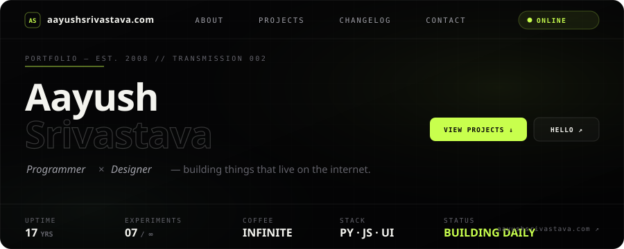
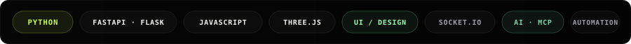
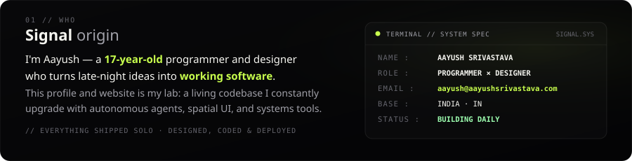
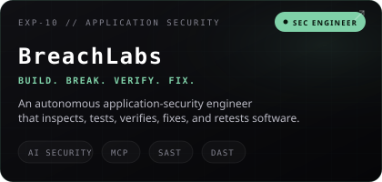
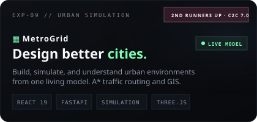
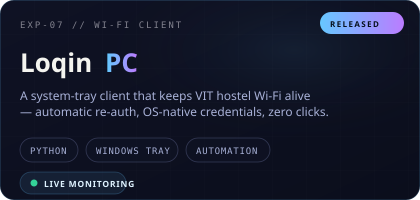
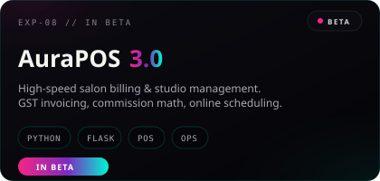
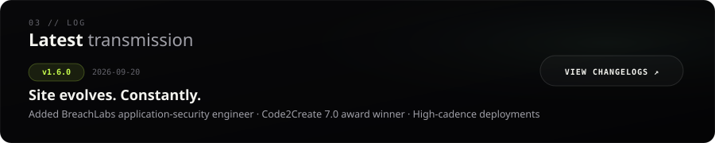
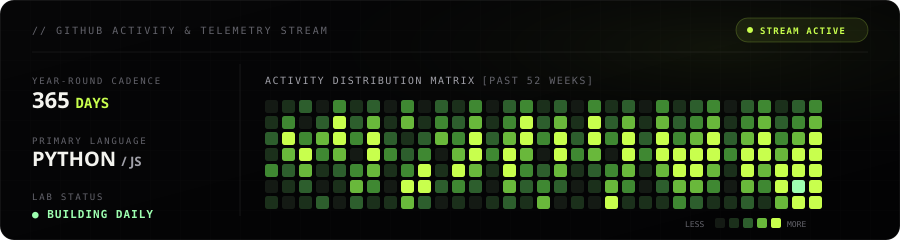
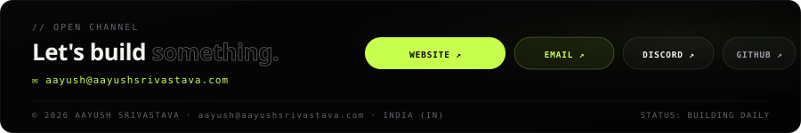

  

   

  

   

  

    
    
    
    
    
  

  

 

  

    <code>01 // WHO</code> &nbsp;·&nbsp; <b>Signal origin</b>
  

  

> *"I'm Aayush — a 17-year-old programmer and designer who turns late-night ideas into working software. Everything from the games to the storage services and user interfaces is designed, built, and shipped solo."*

  

 

  

    <code>02 // WORK</code> &nbsp;·&nbsp; <b>Selected experiments</b>
  

  

    
    
  

  

    
    
  

  
<b>View Additional Micro-Experiments &amp; Tools (EXP-01 → EXP-06)</b>

   

  | ID | Experiment | Stack | Description |
  |:---|:---|:---|:---|
  | <code>EXP-01</code> | <b>Snake Game</b> | Canvas · Vanilla JS | Classic arcade rebuilt with smooth grid physics and high score chase. |
  | <code>EXP-02</code> | <b>Minimax Tic-Tac-Toe</b> | AI · Minimax Algorithm | Unbeatable algorithmic bot from casual to impossible difficulty. |
  | <code>EXP-03</code> | <b>MD·HTML Playground</b> | Live Sandbox · Web | Real-time split-pane markdown and raw HTML renderer. |
  | <code>EXP-05</code> | <b>Knock-off IRC</b> | Python · Socket.IO · Realtime | Ephemeral chatrooms, presence tracking, and instant messaging. |
  | <code>EXP-06</code> | <b>sus</b> | Media · Web | A certified classic web meme experiment. |

  

 

  

    <code>03 // LOG</code> &nbsp;·&nbsp; <b>Latest transmission</b>
  

  

  
<b>View Full System Changelog Archive (v1.6.0 → v1.3.0)</b>

   

  * **<code>v1.6.0</code>** *(2026-09-20)* — Added BreachLabs showcase card at <code>breachlabs.vercel.app</code>. Designated BreachLabs as Latest Project with emerald cyber theme.
  * **<code>v1.5.2</code>** *(2026-09-10)* — Heavy render optimizations for low-end hardware, MetroGrid visual tuning, and UI fixes.
  * **<code>v1.5.0</code>** *(2026-09-09)* — Added MetroGrid showcase at <code>metrogrid.vercel.app</code> with <b>Code2Create 7.0 (2nd Runners Up)</b> tag and spinning C2C interactive button.
  * **<code>v1.4.3</code>** *(2026-09-04)* — Added AuraPOS 3.0 billing client beta reference.
  * **<code>v1.4.0</code>** *(2026-09-02)* — Released Loqin PC system-tray automation client reference at <code>loqin-vit.vercel.app</code>.
  * **<code>v1.3.0</code>** *(2026-06-03)* — Introduced changelogs telemetry, <code>gevent</code> async mode for Socket.IO, and file storage engine optimizations.

  

 

  

    <code>04 // TELEMETRY</code> &nbsp;·&nbsp; <b>GitHub activity &amp; stream</b>
  

  

   

  

    
    
  

  

    
  

  

 

  

    <code>05 // OPEN CHANNEL</code> &nbsp;·&nbsp; <b>Dispatch &amp; Contact</b>
  

  

   

  

    <b>Direct Dispatch:</b> <a href="mailto:aayush@aayushsrivastava.com"><code>aayush@aayushsrivastava.com</code></a> &nbsp;·&nbsp; <b>Portfolio:</b> <a href="https://aayushsrivastava.com"><code>aayushsrivastava.com</code></a> &nbsp;·&nbsp; <b>Discord:</b> <a href="https://discord.com/users/795873954668871731"><code>@aayushsrivastava</code></a>
  

